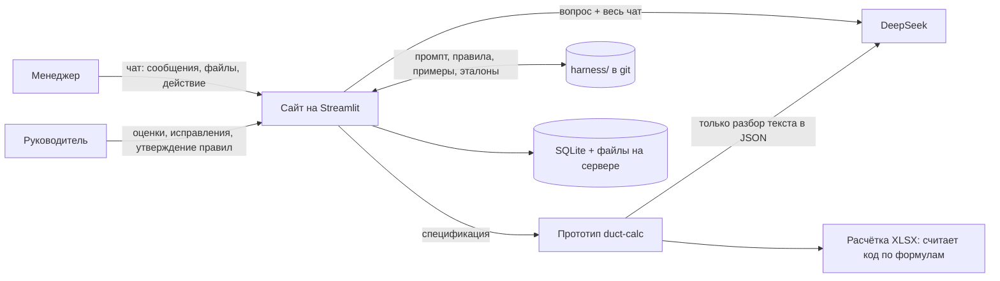
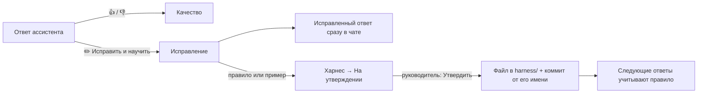

# ameri

Рабочее место менеджеров по полипропиленовым воздуховодам: сайт на Streamlit с ассистентом на модели DeepSeek под контролем руководителя.

**Сайт:** https://159-194-254-146.sslip.io

Менеджеры ведут **чаты** по своим задачам: пишут, загружают спецификации клиентов, задают вопросы ассистенту и строят **расчётки** — XLSX с площадями и ценами по шаблону компании. Руководитель видит все чаты, оценивает и исправляет ответы ассистента. Из исправлений растёт **харнес** — промпты, правила, примеры и эталоны в этом репозитории, — и ассистент со временем работает точнее. Каждое изменение харнеса — коммит в git: его видно и можно откатить.

Для агентов (Cursor, ZCode, Claude Code) краткая выжимка — в [AGENTS.md](AGENTS.md). Термины проекта — в [CONTEXT.md](CONTEXT.md).

---

## Как это работает



Главный принцип: **модель не калькулятор**. DeepSeek разбирает текст спецификации (какие позиции, типы, размеры) и отвечает на вопросы. Площади, массы и цены считает код по формулам компании. Если данных не хватает, позиция помечается красным и уходит на уточнение, а не заполняется догадкой.

---

## Сайт: страницы и роли

| Страница | Кто видит | Что там |
|---|---|---|
| **Чаты** | все | Список чатов с поиском, «Новый чат», переписка с вложениями. У каждого сообщения выбирается действие (см. ниже). Менеджер видит свои чаты, руководитель и администратор — все, с фильтром по автору |
| **Новому сотруднику** | все | Чек-лист онбординга и кнопка «Открыть учебный чат» с учебной спецификацией |
| **О проекте**, **Как работать**, **Примеры работы** | все | Статьи из `docs/site/*.md`; «Примеры работы» — разобранные реальные запросы |
| **Качество** | руководитель, администратор | По каждому менеджеру: чаты, сообщения, ответы ассистента, 👍/👎, исправления, токены; доля попаданий в кэш DeepSeek; последние плохие ответы со ссылками на чаты |
| **Харнес** | руководитель | «На утверждении», «Правила», «Примеры», «Промпт», «История изменений», «Обновление» |
| **Настройки** | администратор | Кнопка «Обновить сайт», ключ DeepSeek, пользователи (добавить, сменить пароль, удалить) |

Роли и права задаются в `harness/access.yaml`:

| Роль | Права |
|---|---|
| Менеджер (`manager`) | создавать чаты, «Вопрос ассистенту», «Расчётка воздуховодов» |
| Руководитель (`leader`) | то же + видеть все чаты, оценивать и исправлять ответы, править харнес, страница «Качество» |
| Администратор (`admin`) | все чаты, «Качество», «Настройки»; один человек может быть и администратором, и руководителем |

Права проверяет код на каждом действии, а не только интерфейс.

### Действия в чате

Над полем ввода выбирается действие для сообщения:

- **Вопрос ассистенту** — DeepSeek отвечает по всей переписке чата и тексту вложений (`.md`, `.txt`, `.csv`, `.xlsx`, `.docx`, `.doc`, `.odt`).
- **Расчётка воздуховодов** — нужен приложенный файл спецификации (`.md`, `.xlsx`, `.docx`, `.doc`, `.odt`, `.csv`) и тип соединения (фланец, раструб, без соединения). Ответ — сводка и XLSX-файл для скачивания.
- **Без ассистента** — просто сообщение и файлы в чат. Так руководитель пишет менеджеру, а менеджер оставляет заметку.

### Расчётка воздуховодов

Считает прототип **duct-calc** (в репозитории его нет — см. «Сервер»):

1. Документ режется на части по 90 строк; DeepSeek (`deepseek-flash`, JSON mode) находит границы позиций и для каждой — тип элемента, размеры, длину, количество, торцы.
2. Код проверяет ответ: формат JSON, пропуски, дубли, совпадение числа позиций и суммы количеств с документом. Количество всегда берётся из исходной строки.
3. Код применяет правила по умолчанию: метраж режется по 1500 мм; отвод без градусов — 90°; переход без длины — 200/300/600 мм по периметру; ответвление тройника — 500 мм; вылет и высота зонта — 500 мм; толщина — по таблице толщин; шибер = 1 м прямого участка; клапан = 2 × метр прямого участка; решётка = 2 × заглушка; ниппель — одно раструбное соединение.
4. Покупные изделия (скрубберы, фильтры, короба, гибкие вставки, хомуты, вентиляторы…) и позиции толще 10 мм переносятся в файл без расчёта.
5. Код считает площади, фланцы и раструбы, коэффициенты и цену ПП из шаблона, заполняет лист «Таблица» и пересчитывает формулы через LibreOffice.

Распознаются: прямые участки, отводы, переходы, тройники, заглушки, зонты, дефлекторы, ниппели, шиберы, клапаны, решётки.

### Подключение DeepSeek

- Модель `deepseek-flash`, OpenAI-совместимый API `https://api.deepseek.com`; ключ — на странице «Настройки» (хранится только на сервере).
- Харнес (промпт → правила → примеры) всегда идёт **первым и в одном порядке**: DeepSeek кэширует одинаковое начало запроса, и оно стоит в десятки раз дешевле. Доля попаданий видна на странице «Качество».
- Для ответов в чате режим рассуждений выключен, `temperature` 0.3; история чата обрезается до ~150 тыс. символов (сначала отбрасываются старые сообщения).
- При сетевой ошибке, 429 или 5xx — одна повторная попытка. Токены (вход, выход, из кэша) и версия харнеса записываются к каждому ответу.

---

## Харнес: как он устроен и как обучается

```
harness/
├── access.yaml              # роли и права
├── prompts/assistant.md     # основной промпт ассистента
├── rules/*.md               # правила, утверждённые руководителем (по одному на файл)
├── examples/*.md            # примеры «вопрос → правильный ответ»
├── duct_calc/
│   ├── parse_rules.md       # правила разбора спецификаций — дописываются к промпту прототипа
│   └── params.yaml          # ключевые слова расчёта: покупные позиции, решётки, клапаны
└── evals/<эталон>/          # реальный запрос (spec.*) + ожидаемый разбор (expected.yaml)
```

### Цикл учителя



1. Руководитель под ответом ассистента ставит 👍/👎 или нажимает **«✏️ Исправить и научить»**: пишет, как надо было ответить, при желании — правило и «сохранить как пример».
2. Исправленный ответ сразу появляется в чате у менеджера.
3. Правило/пример ждут на странице **«Харнес» → «На утверждении»**; руководитель правит формулировку и нажимает **«Утвердить»** (или «Отклонить»).
4. Сайт пишет файл в `harness/rules/` или `harness/examples/` и делает git-коммит от имени руководителя. Утверждение — это кнопка, её проверяет код; модель не может сама «утвердить» правило.
5. Лишнее правило удаляется кнопкой на вкладке «Правила» (тоже коммит). Промпт правится на вкладке «Промпт».

### Эталоны

Реальные запросы клиентов (метаданные очищены, персональных данных нет) с ожидаемым разбором каждой позиции. Правила разбора проверяются на них:

```bash
DEEPSEEK_API_KEY=... AMERI_DUCT_CALC_DIR=/путь/к/duct-calc python tools/run_evals.py
python tools/run_evals.py --no-harness      # для сравнения — без правил харнеса
```

Сейчас с харнесом — 34 из 38 проверок; без него на первых двух эталонах было 20 из 29. Как добавить эталон — [harness/evals/README.md](harness/evals/README.md).

Правила пишите коротко, по одному на файл, с заголовком `### ...`. Перед добавлением проверьте, нет ли похожего: лучше уточнить существующее, чем добавить противоречащее. Подробно о практиках — [docs/practices.md](docs/practices.md).

---

## API

Кроме страниц, сайт отвечает по HTTP на `https://<сайт>/api/v1/...` — для скриптов и агентов (например, облачных сессий Claude Code, у которых нет WebSocket для Streamlit). API делает **то же, что кнопки на сайте**, теми же функциями ядра (`ameri.chat_service`, `ameri.users_service`) и с теми же правами (`harness/access.yaml`). Описание в формате OpenAPI — `/api/docs`.

| Запрос | Что делает | Кому |
|---|---|---|
| `POST /api/v1/login {login, password}` | токен на 12 часов: `{token, expires_at}` | всем; после 5 неудач за 15 минут — 429 |
| `GET /api/v1/me` | логин, имя, роль, гранты, доступные действия | всем |
| `GET /api/v1/chats?query=&author=` | видимые чаты | менеджер — свои, `chat.view_all` — все |
| `POST /api/v1/chats {title}` | новый чат | `chat.create` |
| `GET /api/v1/chats/{id}/messages` | сообщения с вложениями (id, имя, размер) и оценками | автор чата и `chat.view_all` |
| `POST /api/v1/chats/{id}/messages` | multipart: `text`, `action` = `ask` \| `duct_calc` \| `note`, `connection` = `flange` \| `socket` \| `none`, `files` (можно несколько); ответ — сообщение пользователя и ассистента | как на сайте |
| `GET /api/v1/files/{attachment_id}` | скачать вложение или расчётку | кто видит чат |
| `POST /api/v1/messages/{id}/feedback {rating, comment?, corrected_text?, rule_text?, as_example?}` | 👍/👎 или «Исправить и научить»: с `corrected_text` в чат добавляется «Исправление руководителя», правило ждёт утверждения на странице «Харнес» | `feedback.review` |
| `GET /api/v1/users`, `POST /api/v1/users {login, name, role, password}`, `DELETE /api/v1/users/{login}` | пользователи — как форма в «Настройках» | только `admin` |
| `POST /api/v1/update`, `GET /api/v1/update` | «Обновить сайт из репозитория» и статус обновления (`status.state`: `running` / `done` / `error`, `status.commit`) | `admin` и `harness.edit` |

Остальные запросы — с заголовком `Authorization: Bearer <token>`. Токен подписан секретом `data/secrets/api_secret` (создаётся при первом запуске); смена пароля или удаление пользователя отзывает его токены. Утверждения правил и ключа DeepSeek в API нет — только на сайте.

```bash
TOKEN=$(curl -s https://<сайт>/api/v1/login -H 'content-type: application/json' \
  -d '{"login": "anna", "password": "..."}' | jq -r .token)
curl -s https://<сайт>/api/v1/chats -H "Authorization: Bearer $TOKEN"
curl -s https://<сайт>/api/v1/chats/12/messages -H "Authorization: Bearer $TOKEN" \
  -F action=duct_calc -F connection=socket -F text="Расчётка" -F files=@spec.xlsx
```

Расчётка идёт несколько минут: держите таймаут клиента не меньше 10 минут (Caddy ждёт до 15). Пример клиента — `tools/demo_via_api.py`.

---

## Сервер

| | |
|---|---|
| Провайдер | Beget, панель https://cp.beget.com/cloud/servers/list, аккаунт `tetrabeget` |
| Сервер | `ameri`, Санкт-Петербург, 2 CPU / 4 ГБ / 40 ГБ NVMe, Ubuntu 24.04, тариф Plus 990 ₽/мес |
| Адрес | https://159-194-254-146.sslip.io (IP 159.194.254.146; сертификат Let's Encrypt выпускает Caddy) |
| Вход | `ssh root@159.194.254.146` — только по SSH-ключу (пароль root по SSH не работает); консоль — «Terminal (VNC)» в панели |

### Что где лежит на сервере

```
/srv/ameri/
├── app/            # клон этого репозитория (из него собирается образ)
├── data/           # ДАННЫЕ — не трогаются при обновлениях
│   ├── ameri.sqlite3          # чаты, сообщения, оценки, онбординг
│   ├── files/                 # вложения и расчётки
│   ├── users.toml             # пользователи (пароли — хэши scrypt), права 600
│   ├── secrets/deepseek_api_key, secrets/api_secret (подпись токенов API)
│   ├── repo/                  # рабочая копия репозитория: из неё сайт читает харнес и статьи
│   └── update-status.json     # итог последнего обновления
├── duct-calc/      # прототип расчётки (распакованный zip, в git его нет)
└── backups/        # ночные архивы data (14 дней) и копии базы перед обновлениями (10 шт.)
```

Сервисы (`deploy/docker-compose.yml`, проект `ameri`): **app** — Streamlit на порту 8501 и HTTP API (uvicorn) на 8000 в одном контейнере (`deploy/entrypoint.sh` следит за обоими; упал один — контейнер перезапускается), образ `deploy/Dockerfile` с LibreOffice; **caddy** — HTTPS на 80/443, `/api/*` → app:8000, остальное → app:8501. Кроме того, systemd-служба **ameri-update.path** ждёт заявку на обновление от кнопки на сайте и запускает `deploy/autoupdate.sh`.

### Установка с нуля

На чистой Ubuntu 24.04 от root:

```bash
curl -fsSL https://raw.githubusercontent.com/exmuzzy/ameri/master/deploy/bootstrap.sh | bash
# на Beget, где остался недоустановленный Coolify:  curl -sL raw.githubusercontent.com/exmuzzy/ameri/master/i|bash
```

Скрипт ставит Docker, файрвол, swap, клонирует репозиторий в `/srv/ameri/app`, создаёт пользователя `admin` (пароль печатает в конце), подключает службу обновления и запускает сайт. Затем:

1. Войти под `admin`, в «Настройках» вставить ключ DeepSeek и завести пользователей.
2. Загрузить прототип расчётки с компьютера: `scp duct-calc-*.zip root@<ip>:/tmp/duct-calc.zip`, на сервере `unzip -oq /tmp/duct-calc.zip -d /srv/ameri/duct-calc` (внутри должны быть `src/` и `data/`). Перезапуск не нужен.

### Обновление

**Кнопка «🔄 Обновить сайт из репозитория»** — администратору в «Настройках», руководителю в «Харнес» → «Обновление»:

1. Сайт сразу подтягивает из GitHub харнес и статьи в `/srv/ameri/data/repo` — без перезапуска.
2. Сайт создаёт файл-заявку `/srv/ameri/data/update-request`; systemd (`ameri-update.path`) запускает `deploy/autoupdate.sh`.
3. Скрипт берёт `origin/master`. Если изменились только `harness/`, `docs/`, `README.md`, `CONTEXT.md` — всё. Если изменился код — копия базы в `backups/`, `docker compose up -d --build`, сайт перезапускается (пара минут, страницы переподключатся сами).
4. Итог (версия, время, кто запросил, успех/ошибка) показывается рядом с кнопкой; журнал — `/var/log/ameri-update.log`.

Без кнопки: `ssh root@159.194.254.146 /srv/ameri/app/deploy/autoupdate.sh`.

Если служба обновления ещё не подключена (сайт покажет предупреждение), один раз на сервере:
`cd /srv/ameri/app && git pull && bash deploy/install-autoupdate.sh`.

### Данные при обновлении

- База, файлы, пользователи и ключ лежат в `/srv/ameri/data` — отдельно от кода; пересборка их не трогает.
- Если в новой версии у таблиц появляются столбцы, сайт при старте добавляет их сам (`Store._migrate`), данные сохраняются.
- Перед каждой пересборкой — копия базы в `/srv/ameri/backups/ameri-before-update-*.sqlite3`; каждую ночь — архив всего `data/` (14 дней).
- Восстановить базу: остановить сайт (`cd /srv/ameri/app/deploy && docker compose stop app`), скопировать нужную копию в `/srv/ameri/data/ameri.sqlite3`, запустить (`docker compose start app`).

### Настройки сервера (`/srv/ameri/app/deploy/.env`)

| Переменная | Зачем |
|---|---|
| `SITE_ADDRESS` | Адрес сайта для Caddy; по умолчанию `<ip-через-дефисы>.sslip.io` |
| `AMERI_GIT_URL` | Репозиторий для рабочей копии харнеса; по умолчанию публичный `https://github.com/exmuzzy/ameri.git`. Чтобы утверждённые правила уходили в GitHub — URL с токеном записи |
| `AMERI_GIT_PUSH` | `1` — отправлять коммиты харнеса в GitHub (нужен токен в `AMERI_GIT_URL`); по умолчанию `0` |

После правки `.env`: `cd /srv/ameri/app/deploy && docker compose up -d`.

---

## Как обновлять содержимое

| Что меняем | Где | Кто и чем | Когда видно на сайте |
|---|---|---|---|
| Правила и примеры | `harness/rules/`, `harness/examples/` | Руководитель — на сайте (исправления → утверждение) | Сразу |
| Промпт ассистента | `harness/prompts/assistant.md` | Руководитель — «Харнес» → «Промпт» или в ZCode/Cursor | Сразу / после «Обновить сайт» |
| Правила разбора и ключевые слова расчёта | `harness/duct_calc/` | В ZCode/Cursor; проверить `tools/run_evals.py` | После «Обновить сайт» |
| Статьи | `docs/site/*.md` | В ZCode/Cursor или веб-редакторе GitHub | После «Обновить сайт» |
| Роли и права | `harness/access.yaml` | В ZCode/Cursor | После «Обновить сайт» |
| Пользователи, ключ DeepSeek | только на сервере | Администратор — «Настройки» | Сразу |
| Код сайта | `app/`, `src/ameri/`, `deploy/` | Разработчик (claude-ds, ZCode, Cursor) | После «Обновить сайт» (пересборка) |

Правка в репозитории:

```bash
git pull origin master
# правки
python -m pytest -q
git commit -am "Харнес: <что и зачем>" && git push origin master
```

и на сайте — **«Обновить сайт»**.

> Правила, утверждённые на сайте, пока коммитятся только в копию на сервере (`/srv/ameri/data/repo`): чтобы они попадали в GitHub, задайте токен (см. «Настройки сервера»). Если одно правило изменить и на сайте, и в репозитории, обновление сообщит о конфликте — его решают вручную в `/srv/ameri/data/repo`.

---

## Локальная разработка

```bash
pip install -r requirements.txt
python -m pytest -q                                   # 19 тестов
mkdir -p var && python tools/hash_password.py         # хэш пароля
# var/users.toml:
#   [users.anna]
#   name = "Анна"
#   role = "manager"
#   password_hash = "scrypt$..."
DEEPSEEK_API_KEY=... AMERI_DUCT_CALC_DIR=/путь/к/duct-calc streamlit run app/main.py
```

Без `AMERI_DUCT_CALC_DIR` сайт работает, но действия «Расчётка воздуховодов» нет. Без ключа DeepSeek ассистент отвечает, что ключ не задан.

---

## Что ещё не сделано

- **CLI для инструментов руководителя** (`tools/ameri_cli.py` поверх [API](#api)): отчёты «что делал менеджер за неделю» для ZCode/Cursor.
- **Опрос настройки** — страница, где ассистент раундами расспрашивает руководителя и записывает ответы в харнес.
- **Отправка харнеса в GitHub** — нужен токен записи (Q27).
- **Проекты с участниками** — сейчас чат принадлежит автору и виден руководителям.
- **Доработки прототипа:** соединения по торцам, нарезка метража «как в КП», заголовки без количества, купол зонта, «фланец20» — вопросы Q37–Q41 в [docs/decisions.md](docs/decisions.md).
- Проверка эталонов перед утверждением правила на сайте (сейчас — вручную через `tools/run_evals.py`).

---

## Документы

- [AGENTS.md](AGENTS.md) — выжимка для агентов
- [Промпт для оформления сайта](prompts/design-site.md) — задание агенту-дизайнеру
- [Промпт для демо-чатов](prompts/demo-chats.md) — задание агенту: 10 демонстрационных чатов
- [Промпт для исследования отрасли](prompts/industry-research.md) — задание агенту: что узнать об отрасли, чтобы дообучить харнес
- [План реализации](docs/plan.md), [протокол решений](docs/decisions.md), [ADR](docs/adr/)
- [Практики обучения харнеса](docs/practices.md) — цикл учителя, подключение DeepSeek
- [Исследование](docs/research.md), [выбор VPS](docs/vps.md)
- [claude-ds](docs/claude-ds.md) — Claude Code на модели DeepSeek
- [Развёртывание на bishkek](docs/handoff-bishkek.md) — альтернативный сервер заказчика
- Скиллы для агентов: [.claude/skills](.claude/skills/README.md)
