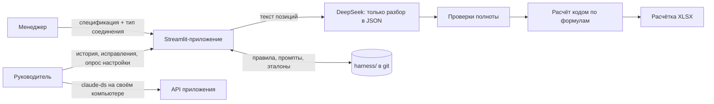

# ameri

Веб-приложение для работы менеджеров с моделью DeepSeek под контролем руководителя.

Менеджеры загружают документы в проекты и запускают **типовые действия**. Первое из них — **расчётка воздуховодов**: из спецификации заказчика получается XLSX с площадями и ценами по шаблону компании. Руководитель видит всю историю работы, исправляет ошибки и через **харнес** — набор правил, промптов и эталонов в этом репозитории — учит систему считать правильно. Харнес растёт с каждым исправлением и хранится в git, так что любое изменение видно и откатывается.

## Как это работает

Главный принцип: **модель не калькулятор**. DeepSeek только разбирает текст спецификации: какие позиции, какие типы и размеры. Площади, массы и цены считает код. Если данных не хватает, позиция уходит на уточнение, а не заполняется догадкой.

## Первое типовое действие: расчётка воздуховодов

Основа проекта — прототип duct-calc («Расчётка воздуховодов»). Он считает стоимость изготовления **полипропиленовых воздуховодов** по спецификации заказчика.

**Вход:**
- спецификация в `.md`, `.xlsx`, `.docx`, `.doc` или `.csv`;
- один тип соединения на весь файл: фланец, раструб или без соединения.

**Что распознаётся:**
- прямые участки, круглые и прямоугольные;
- отводы;
- переходы: круг–круг, прямоугольник–круг, прямоугольник–прямоугольник;
- тройники;
- заглушки;
- зонты и дефлекторы;
- особые позиции: ниппели, шиберы, клапаны, решётки.

Слова «ПНД», «ПП» и «полиэтилен» считаются тем же полипропиленом.

**Как считается:**
1. Документ разбивается на части по 90 строк.
2. DeepSeek (`deepseek-flash`, JSON mode) определяет границы позиций, затем для каждой позиции — тип элемента, размеры, длину, количество и торцы.
3. Код проверяет ответ модели:
   - соблюдён ли формат JSON;
   - нет ли пропусков, дублей и лишних строк;
   - совпадает ли число позиций и сумма количеств с исходным документом.

   Количество всегда берётся из исходной строки, а не из ответа модели.
4. Код применяет правила по умолчанию:
   - метраж прямых участков режется на отрезки по 1500 мм;
   - отвод без указания градусов считается на 90°;
   - переход без длины — 200, 300 или 600 мм в зависимости от периметра сечения;
   - ответвление тройника — 500 мм;
   - вылет и высота зонта — 500 мм;
   - толщина стенки — по таблице толщин;
   - шибер считается как 1 м прямого участка, клапан — как 2 × цена метра прямого участка, решётка — как 2 × цена заглушки;
   - ниппель считается как одно раструбное соединение.
5. Покупные изделия (скрубберы, фильтры, короба и т. п.) и позиции с толщиной больше 10 мм не рассчитываются: они переносятся в итоговый файл как есть.
6. Код считает площади по формулам, стоимость фланцев и раструбов по сечениям, применяет коэффициенты и цену ПП из шаблона. Затем заполняет лист «Таблица» шаблона и пересчитывает формулы через LibreOffice.

**Выход:** предпросмотр позиций со статусами и XLSX-расчётка с колонкой «СИСТЕМА» (В.1, П.1 и т. п.). Позиции, требующие внимания, выделены красным. Если безопасно определить геометрию нельзя, расчётка не строится, пока человек не ответит на уточнение.

В проекте ameri прототип становится многопользовательским: проекты, вход по логину, история, роли. Правила из пункта 4 переезжают из кода в харнес, где их видит и меняет руководитель.

## Роли

| Роль | Что делает |
|---|---|
| Менеджер | Работает в назначенных проектах: загружает спецификации, строит расчётки, отвечает на уточнения |
| Руководитель | Видит всю историю, исправляет результаты, утверждает правила, проходит опрос настройки |
| Администратор | Сервер, ключи, учётные записи, назначение руководителей |

Термины проекта — в [CONTEXT.md](CONTEXT.md).

## Статус

Этап планирования. Основа — рабочий прототип расчётки воздуховодов (Streamlit + DeepSeek), который будет перенесён в этот репозиторий.

## Документы

- [План реализации](docs/plan.md)
- [Протокол решений](docs/decisions.md) и [ADR](docs/adr/)
- [Исследование](docs/research.md): DeepSeek, Claude Code, самообучение харнеса, eval
- [claude-ds](docs/claude-ds.md): Claude Code на модели DeepSeek
- Скиллы для агентов: [.claude/skills](.claude/skills/README.md)
