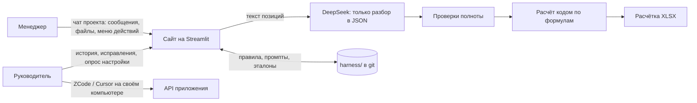
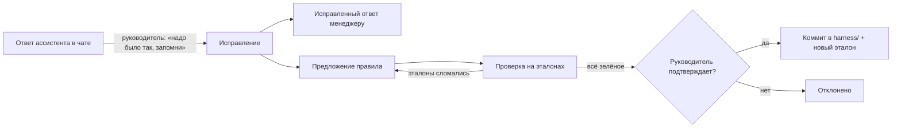

# ameri

Веб-приложение для работы менеджеров с моделью DeepSeek под контролем руководителя.

Менеджеры работают в чатах проектов: переписываются, загружают файлы, задают вопросы и запускают **типовые действия** через меню ассистента. Первое из них — **расчётка воздуховодов**: из спецификации заказчика получается XLSX с площадями и ценами по шаблону компании. Руководитель видит всю историю работы, исправляет ошибки и через **харнес** — набор правил, промптов и эталонов в этом репозитории — учит систему считать правильно. Харнес растёт с каждым исправлением и хранится в git, так что любое изменение видно и откатывается.

## Как это работает

Главный принцип: **модель не калькулятор**. DeepSeek только разбирает текст спецификации: какие позиции, какие типы и размеры. Площади, массы и цены считает код. Если данных не хватает, позиция уходит на уточнение, а не заполняется догадкой.

## Работа в чате проекта

Каждый проект — это **чат на сайте** (Streamlit, `st.chat_message` / `st.chat_input`). В нём работают менеджеры проекта, руководители и ассистент ameri. Проект закреплён за своей темой (объект, заказ, направление). Проектов может быть сколько угодно, а менеджер видит только те, в которые его назначили.

### Что делают менеджеры

- **Пишут сообщения и переписываются** между собой в чате проекта.
- **Загружают файлы**: спецификации, таблицы, документы, фото. Файлы прикрепляются к сообщению и остаются в проекте.
- **Задают вопросы ассистенту**, в основном через **меню типовых действий**, а не свободным диалогом с моделью. Меню открывается кнопкой в чате и зависит от проекта и прав менеджера. Примеры действий:
  - «Расчётка воздуховодов» по загруженной спецификации;
  - «Сводка обсуждения»;
  - «Ответить на вопрос по файлу».

  Состав меню задаёт руководитель.
- **Свободные вопросы к модели** доступны только если руководитель это разрешил, и в пределах лимитов.
- **Отвечают на уточнения ассистента**, если для расчёта не хватает данных. Например: «у тройника в позиции 7 не указана длина ответвления — взять 500 мм?».

Всё сохраняется в **истории**: сообщения, файлы, вызванные действия, ответы ассистента, уточнения, кто и когда это сделал. Имена участников известны, анонимных действий нет.

### Что делают руководители

- **Видят все чаты своих проектов**: что пишут менеджеры, какие файлы загружают, какие вопросы задают, что отвечает ассистент.
- **Спрашивают ассистента о работе**: «что происходит в проекте X», «что сегодня сделал менеджер Y», «какие позиции чаще всего уходят на уточнение».
- **Поручают ответ менеджеру**: «ответь менеджеру Y, что клапаны в этом заказе считаем как 3 метра прямого участка». Ассистент пишет ответ в чат проекта с пометкой, что он согласован руководителем.
- **Исправляют ассистента**: у каждого ответа есть кнопка «Исправить». Руководитель пишет «ты ответил так-то, а надо было так-то, исправь ответ и запомни это». Ассистент исправляет ответ в чате, а из исправления рождается новое правило харнеса (см. ниже).
- **Управляют проектами и правами**: создают проекты, назначают менеджеров, выдают гранты (какие типовые действия и можно ли задавать свободные вопросы), настраивают меню.
- **Работают из ZCode или Cursor на своём компьютере** с копией этого репозитория: читают историю через API сайта, правят харнес и сложные правила в коде.

## Как настраивается и обучается харнес

**Харнес** — всё, что определяет поведение ассистента, и он хранится в этом репозитории, в каталоге `harness/`:
- системные промпты;
- правила разбора и расчёта;
- меню типовых действий;
- гранты;
- эталонные примеры.

Руководитель видит все действующие правила: глобальные, для проекта и для типового действия.

**Первичная настройка — опрос настройки.** Руководитель открывает на сайте страницу «Опрос настройки», и ассистент задаёт ему вопросы по методу [grilling](.claude/skills/grilling/SKILL.md).
- Вопросы идут раундами. В раунде только те вопросы, на которые уже можно ответить; у каждого есть рекомендованный ответ.
- Вопросы касаются того, чем занимаются менеджеры, какие нужны типовые действия и права, как отвечать и что считать по умолчанию (например, «отвод без градусов — 90°?»).
- Опрос можно прервать и продолжить. Повторный опрос уточняет уже существующий харнес.
- В конце руководитель видит сводку изменений и подтверждает её. Только после этого изменения коммитятся в `harness/`.

**Обучение на исправлениях.** Харнес растёт из ежедневной работы:

- Ассистент по исправлению предлагает одно из трёх: изменить промпт, изменить параметр расчёта или задание на правку кода для ZCode или Cursor.
- Перед применением изменение проверяется на **эталонах** — примерах с заранее проверенным правильным результатом. Правило, которое ломает старые расчёты, не применяется.
- Подтверждение — это кнопка руководителя, её проверяет код. Модель не может «сама решить», что правило утверждено.
- Исправленный случай становится новым эталоном. Каждый ответ ассистента помнит, по какой версии харнеса он дан, поэтому любой результат можно воспроизвести, а любое правило — откатить через git.

Менеджеры харнес не меняют. Они работают в рамках того, что разрешил руководитель.

## Первое типовое действие: расчётка воздуховодов

Основа проекта — прототип duct-calc («Расчётка воздуховодов»). Он считает стоимость изготовления **полипропиленовых воздуховодов** по спецификации заказчика.

**Вход:**
- спецификация в `.md`, `.xlsx`, `.docx`, `.doc` или `.csv`;
- один тип соединения на весь файл: фланец, раструб или без соединения.

**Что распознаётся:**
- прямые участки, круглые и прямоугольные;
- отводы;
- переходы: круг–круг, прямоугольник–круг, прямоугольник–прямоугольник;
- тройники;
- заглушки;
- зонты и дефлекторы;
- особые позиции: ниппели, шиберы, клапаны, решётки.

Слова «ПНД», «ПП» и «полиэтилен» считаются тем же полипропиленом.

**Как считается:**
1. Документ разбивается на части по 90 строк.
2. DeepSeek (`deepseek-flash`, JSON mode) определяет границы позиций, затем для каждой позиции — тип элемента, размеры, длину, количество и торцы.
3. Код проверяет ответ модели:
   - соблюдён ли формат JSON;
   - нет ли пропусков, дублей и лишних строк;
   - совпадает ли число позиций и сумма количеств с исходным документом.

   Количество всегда берётся из исходной строки, а не из ответа модели.
4. Код применяет правила по умолчанию:
   - метраж прямых участков режется на отрезки по 1500 мм;
   - отвод без указания градусов считается на 90°;
   - переход без длины — 200, 300 или 600 мм в зависимости от периметра сечения;
   - ответвление тройника — 500 мм;
   - вылет и высота зонта — 500 мм;
   - толщина стенки — по таблице толщин;
   - шибер считается как 1 м прямого участка, клапан — как 2 × цена метра прямого участка, решётка — как 2 × цена заглушки;
   - ниппель считается как одно раструбное соединение.
5. Покупные изделия (скрубберы, фильтры, короба и т. п.) и позиции с толщиной больше 10 мм не рассчитываются: они переносятся в итоговый файл как есть.
6. Код считает площади по формулам, стоимость фланцев и раструбов по сечениям, применяет коэффициенты и цену ПП из шаблона. Затем заполняет лист «Таблица» шаблона и пересчитывает формулы через LibreOffice.

**Выход:** предпросмотр позиций со статусами и XLSX-расчётка с колонкой «СИСТЕМА» (В.1, П.1 и т. п.). Позиции, требующие внимания, выделены красным. Если безопасно определить геометрию нельзя, расчётка не строится, пока человек не ответит на уточнение.

В проекте ameri прототип становится многопользовательским: проекты, вход по логину, история, роли. Правила из пункта 4 переезжают из кода в харнес, где их видит и меняет руководитель.

## Роли

| Роль | Что делает |
|---|---|
| Менеджер | Работает в чатах назначенных проектов: переписывается, загружает файлы, вызывает типовые действия, отвечает на уточнения |
| Руководитель | Видит все чаты и историю, спрашивает ассистента о работе, поручает ответы, исправляет ассистента, утверждает правила, проходит опрос настройки |
| Администратор | Сервер, ключи, учётные записи, назначение руководителей |

Термины проекта — в [CONTEXT.md](CONTEXT.md).

## Статус

Этап планирования. Основа — рабочий прототип расчётки воздуховодов (Streamlit + DeepSeek), который будет перенесён в этот репозиторий.

## Документы

- [План реализации](docs/plan.md)
- [Протокол решений](docs/decisions.md) и [ADR](docs/adr/)
- [Исследование](docs/research.md): DeepSeek, Claude Code, самообучение харнеса, eval
- [claude-ds](docs/claude-ds.md): Claude Code на модели DeepSeek
- Скиллы для агентов: [.claude/skills](.claude/skills/README.md)
