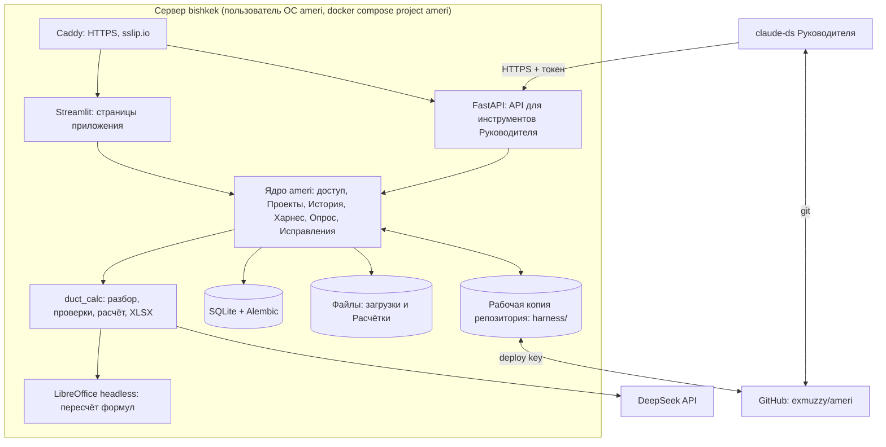
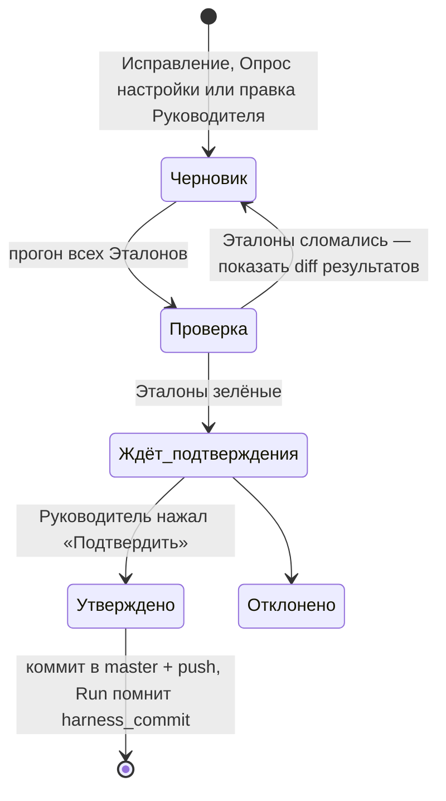

# План реализации ameri

Основано на [протоколе решений](decisions.md) и ADR [0002](adr/0002-no-client-pd-server-in-bishkek.md) и [0003](adr/0003-streamlit-web-app.md). Решения, которые заказчик ещё не подтвердил, помечены **(по умолчанию, Qn)**: план исполняется с ними, пока заказчик не ответит иначе.

## 1. Цель и результат первого этапа

Многопользовательское веб-приложение на базе прототипа duct-calc, развёрнутое на сервере `bishkek`. После первого этапа (MVP):

1. Приложение доступно по HTTPS, в него входят по логину и паролю Администратор, Руководитель и Менеджеры.
2. Менеджер в своём Проекте загружает Спецификацию, получает предпросмотр Позиций, отвечает на Уточнения и скачивает Расчётку. Всё сохраняется в Истории.
3. Руководитель **проходит в приложении Опрос настройки**: раундами отвечает на вопросы с рекомендованными ответами о правилах разбора и расчёта. После подтверждения результат записывается в `harness/` отдельным коммитом.
4. Руководитель видит Историю, делает Исправление неверной Позиции. Система предлагает Правило, проверяет его на Эталонах и после подтверждения коммитит в Харнес.
5. Руководитель из [claude-ds](claude-ds.md) на своём компьютере читает Историю через API приложения и правит Харнес в копии репозитория.

## 2. Исходные условия

| Что | Решение | Источник |
|---|---|---|
| Интерфейс | Сайт на Streamlit | ADR-0003 |
| Сервер | Существующий `bishkek` (Кыргызстан); полная изоляция от уже работающих там сервисов | Q4, Q23 |
| Модель | DeepSeek `deepseek-flash` напрямую через `api.deepseek.com`, JSON mode; аккаунт и ключ уже есть | Q20, Q26 |
| Персональные данные клиентов | Не обрабатываются; приложение предупреждает, если похоже, что они появились в загрузке | ADR-0002, Q14, Q22 |
| Домен | Автоматически: `<ip>.sslip.io` + Let's Encrypt; запасной вариант — самоподписанный сертификат | Q24 |
| Хранение Харнеса | Этот репозиторий, каталог `harness/`, коммиты сразу в `master` после подтверждения в приложении | Q8, Q9 |
| Инструменты Руководителя | Любые; основной — claude-ds на своём компьютере с копией репозитория | Q12, Q13 |
| Репозиторий | Сделать приватным до переноса шаблона с ценами и Харнеса | **(по умолчанию, Q28)** |
| Прототип | Переносится в репозиторий без `DuctCalc.app` | **(по умолчанию, Q29)** |
| Единица работы | Проект; Направления — позже | **(по умолчанию, Q30)** |
| Типовые действия в MVP | Только Расчётка воздуховодов | **(по умолчанию, Q31)** |
| Чат с ассистентом | Не в MVP, в v1 | **(по умолчанию, Q32)** |
| Вход | Логин и пароль, учётки заводит Администратор | **(по умолчанию, Q33)** |
| Правила | Простые — YAML в `harness/`, сложные — код через claude-ds | **(по умолчанию, Q34)** |
| Исправления | Исправление → Правило → проверка на Эталонах → подтверждение → коммит | **(по умолчанию, Q35)** |
| Наблюдение | Страница «История» в приложении | **(по умолчанию, Q36)** |
| Запись в GitHub | Deploy key с правом записи только в этот репозиторий | **(по умолчанию, Q27)** |

## 3. Архитектура



Почему так:
- **Streamlit** — прототип уже на нём, для 2–10 пользователей этого достаточно. Мультистраничность через `st.navigation`, вход — `streamlit-authenticator` или собственная форма поверх таблицы `users`.
- **FastAPI отдельным сервисом** — Streamlit не умеет отдавать REST, а инструментам Руководителя нужен API. Ядро общее, это один Python-пакет.
- **SQLite + Alembic** — пользователей единицы, база в одном файле, бэкап — копия файла. Схема через SQLAlchemy, чтобы при росте перейти на PostgreSQL без переписывания. Критерий перехода: больше 20 одновременных пользователей или ошибки блокировок.
- **Рабочая копия git на сервере** — приложение читает Харнес из неё и коммитит в неё утверждённые изменения. Изменения, сделанные Руководителем локально, приложение подтягивает по кнопке «Обновить Харнес» и каждые 5 минут.
- **LibreOffice** — прототип пересчитывает формулы XLSX через headless LibreOffice, поэтому он нужен в образе.
- **Длинные вызовы модели** (до 120 с на чанк) в MVP выполняются в потоке сессии Streamlit со спиннером. Очередь задач — в v1, если появятся параллельные тяжёлые запуски.

## 4. Структура репозитория

```
ameri/
├── README.md, CONTEXT.md
├── app/                    # Streamlit: main.py и страницы
│   └── pages/              # Проекты, Расчётка, История, Исправления, Опрос настройки, Харнес, Пользователи
├── src/
│   ├── ameri/              # ядро: auth, access, projects, history, storage, harness, setup_survey, corrections, api
│   └── duct_calc/          # перенесённый прототип (разбор, проверки, расчёт, XLSX)
├── harness/
│   ├── access.yaml         # роли, Гранты, список пользователей (без паролей)
│   ├── actions/
│   │   └── duct_calc.yaml  # описание Типового действия: входы, кто может запускать, какие промпты и правила
│   ├── prompts/
│   │   ├── duct_parse.md          # системный промпт разбора (сейчас build_system_prompt)
│   │   └── duct_segmentation.md   # промпт сегментации (сейчас build_segmentation_prompt)
│   ├── rules/
│   │   ├── duct_parse.yaml # Правила разбора: синонимы материалов, трактовки текста
│   │   └── duct_calc.yaml  # Правила расчёта: значения по умолчанию, множители, ключевые слова, таблицы длин
│   ├── setup_survey/
│   │   └── tree.yaml       # стартовое дерево вопросов Опроса настройки
│   └── evals/
│       └── <эталон>/       # spec.* + connection.txt + expected.json
├── data/templates/         # шаблон Расчётки с ценами (только при приватном репозитории)
├── deploy/                 # docker-compose.yml, Dockerfile, Caddyfile, скрипты установки и бэкапа
├── tests/                  # тесты прототипа + ядра + прогон Эталонов
├── docs/                   # план, решения, ADR, исследования
└── .claude/skills/         # скиллы: grilling и др., ameri-history для Руководителя
```

Пароли, ключи DeepSeek и приватная часть deploy key в репозиторий не попадают. Они лежат в `/srv/ameri/secrets/` на сервере и передаются контейнерам через переменные окружения или `secrets` в docker compose.

## 5. Модель данных

| Сущность | Ключевые поля |
|---|---|
| User | login, имя, роль (admin/leader/manager), password_hash, активен |
| Project | название, описание, создан кем, архив |
| ProjectMember | project, user |
| Upload | project, user, имя файла, путь, sha256, размер, время |
| Run | запуск Типового действия: project, user, action, upload, тип соединения, статус (preview/needs_input/done/failed), harness_commit, модель, токены, стоимость, длительность |
| RunPosition | run, source_no, текст, тип, размеры (JSON), кол-во, статус, причина |
| Answer | ответ на Уточнение: run_position, user, значение |
| Result | run, путь к Расчётке, предупреждения |
| Correction | run_position, leader, что было, как правильно, комментарий |
| RuleProposal | correction или setup_session, вид (разбор/расчёт/код), diff Харнеса, результат прогона Эталонов, статус (черновик/утверждено/отклонено), commit |
| SetupSession | Руководитель, область (весь Харнес / Типовое действие), дерево решений (JSON), раунды, ответы, статус |
| ApiToken | user, хэш токена, права, срок, отозван |
| AuditEvent | кто, когда, что (вход, загрузка, запуск, скачивание, Исправление, изменение Гранта, коммит Харнеса) |

Гранты хранятся в `harness/access.yaml`, чтобы изменения были видны в git. В базе только пароли и токены. При изменении пользователей и Грантов в приложении YAML перезаписывается и коммитится, как любое изменение Харнеса.

## 6. Права

| Операция | Менеджер | Руководитель | Администратор |
|---|---|---|---|
| Видеть свои Проекты, загружать, запускать Расчётку, отвечать на Уточнения | ✅ (в назначенных Проектах) | ✅ | — |
| Видеть всю Историю, все Проекты | — | ✅ | ✅ (без содержимого файлов, если не Руководитель) |
| Исправления, утверждение Правил, Опрос настройки | — | ✅ | — |
| Создавать Проекты и назначать Менеджеров | — | ✅ | ✅ |
| Учётные записи, роли, API-токены | — | свои токены | ✅ |

Права проверяются в ядре (`ameri.access`) на каждом действии, и в Streamlit, и в API. Скрытие кнопок в интерфейсе — только удобство, не защита.

## 7. Харнес и самообучение

### 7.1 Что выносится из кода прототипа

Сейчас правила зашиты в `pipeline.py` функциями `with_*`. На этапе переноса они делятся на три вида:

| Вид | Примеры из прототипа | Где будет | Кто меняет |
|---|---|---|---|
| Правила разбора | «ПНД, ПП, полиэтилен = полипропилен», не придумывать значения, формат JSON | `harness/prompts/*.md`, `harness/rules/duct_parse.yaml` | Руководитель в приложении |
| Параметры расчёта | отвод без градусов = 90°; длина перехода по периметру 200/300/600 мм; ответвление тройника 500 мм; вылет и высота зонта 500 мм; шибер = 1 м прямика; клапан = 2 × цена метра прямика; решётка = 2 × цена заглушки; слова покупных позиций; порог толщины 10 мм; длина отрезка 1500 мм; размер чанка 90 строк | `harness/rules/duct_calc.yaml` | Руководитель в приложении |
| Логика расчёта | формулы площадей, фланцы, раструбы, коэффициенты, заполнение шаблона | код `src/duct_calc/` | Руководитель через claude-ds: код + тест + Эталон |

Перенос делается **без изменения поведения**: сначала все 118 тестов прототипа и демонстрационные расчётки становятся Эталонами, потом правила по одному выносятся в YAML, а тесты и Эталоны остаются зелёными.

### 7.2 Жизненный цикл изменения Харнеса



- Подтверждение — это состояние в базе, которое проверяет код. Модель не может «сама решить», что изменение утверждено.
- Каждый Run записывает `harness_commit`, поэтому любую Расчётку можно воспроизвести и понять, по каким правилам она посчитана.
- Откат — `git revert` коммита; в приложении есть кнопка «Откатить» на странице Харнеса (v1), в MVP — через git.

### 7.3 Исправления

1. Руководитель открывает Run из Истории, выбирает Позицию и указывает, как правильно: другой тип, размер, длину или цену, либо «так считать нельзя».
2. Эта Расчётка пересобирается с исправленной Позицией, и Менеджер видит, что её поправили.
3. DeepSeek получает Исправление, текущие Правила и JSON-схему предложения. Он предлагает одно из трёх:
   - изменение Правила разбора;
   - изменение параметра расчёта;
   - «нужна правка кода», и тогда готовит задание для claude-ds.
4. Предложение проходит цикл из 7.2. Спецификация с исправленным результатом добавляется в `harness/evals/` как новый Эталон.

### 7.4 Опрос настройки

Опрос — это метод `grilling` (`.claude/skills/grilling`), встроенный в приложение.

- **Дерево вопросов.** Стартовое дерево лежит в `harness/setup_survey/tree.yaml`. У каждого вопроса есть id, формулировка, зависимости, варианты ответа, рекомендованный ответ и **куда записывается ответ** (файл и ключ Харнеса). Пример ветки: «Отвод без указания градусов считать на 90°?» → `harness/rules/duct_calc.yaml: elbow.default_angle`.
- **Раунд.** Код вычисляет, какие вопросы уже можно задать: все их зависимости отвечены. DeepSeek переформулирует эти вопросы с учётом текущего Харнеса и Истории, например «в 12 из последних 40 Расчёток отводы были без градусов». Добавлять вопросы вне дерева DeepSeek может только как черновики, помеченные «новый».
- **Интерфейс.** Вопросы раунда пронумерованы, рекомендованный вариант выбран заранее. Руководитель может выбрать другой вариант или написать свой. Кнопка «Ответить на раунд» — после неё следующий раунд.
- **Завершение.** Когда вопросов не осталось, показывается сводка изменений Харнеса в виде diff. Коммит делается только по кнопке «Подтвердить», по циклу 7.2.
- **Прерывание.** Опрос можно прервать и продолжить: состояние хранится в `SetupSession`. Повторный опрос начинается с текущего Харнеса.
- **Стартовое дерево для MVP** — вопросы по всем параметрам из 7.1:
  - отводы, переходы, тройники, зонты;
  - шиберы, клапаны, решётки, ниппели;
  - покупные позиции и порог толщины;
  - нарезка метража;
  - синонимы материалов;
  - когда останавливать расчёт на Уточнение;
  - какие Гранты у Менеджеров.

### 7.5 Инструменты Руководителя вне приложения

- `API /api/v1` с личным токеном, только чтение: Проекты, Runs, Позиции, Исправления, История, текущий `harness_commit`.
- Скилл `.claude/skills/ameri-history`: как claude-ds Руководителя вызывает этот API («что делал Менеджер X за неделю», «какие Позиции чаще всего уходят на Уточнение»).
- Изменения Харнеса из claude-ds идут обычным git в `master`. Приложение подтягивает их по кнопке или таймеру и сразу прогоняет Эталоны. Если Эталоны красные, новый Харнес не активируется, и Руководитель видит предупреждение.

## 8. Развёртывание на `bishkek`

Исполнитель работает там, где есть `ssh bishkek`, например на компьютере заказчика.

1. **Осмотр, только чтение.** Узнать:
   - ОС, CPU, RAM, свободный диск;
   - есть ли Docker и docker compose;
   - занятые порты (`ss -ltnp`), особенно 80 и 443;
   - какие сервисы там уже работают и как они запущены: чтобы ничего не задеть;
   - внешний IPv4 и IPv6.

   Итог записать в `docs/server.md`. Ничего не менять.
2. **Изоляция.**
   - пользователь ОС `ameri` и каталог `/srv/ameri`;
   - отдельный compose-проект `ameri` со своей сетью;
   - ресурсы ограничить (`mem_limit`, `cpus`), чтобы не отнять их у уже работающих сервисов.
3. **HTTPS.**
   - **80 и 443 свободны** → Caddy с автоматическим сертификатом для `<ip>.sslip.io`.
   - **Порты заняты** → остановиться и спросить заказчика. Варианты: другой IP, отдельный порт с самоподписанным сертификатом, общий reverse proxy (это нарушает Q23).
4. **Секреты.** Ключ DeepSeek, deploy key и пароль первого Администратора — в `/srv/ameri/secrets/` с правами 600.
5. **Бэкапы.** Каждую ночь: копия SQLite (`sqlite3 .backup`) и каталога файлов, храним 14 дней. Харнес и так в GitHub.
6. **Обновление.** Скрипт `deploy/update.sh`: `git pull` → сборка → миграции Alembic → прогон Эталонов → перезапуск. В v1 — GitHub Actions по SSH.
7. **Мониторинг.**
   - healthcheck контейнеров;
   - страница «Состояние» для Администратора: доступ к DeepSeek, свободное место, последний бэкап, текущий `harness_commit`;
   - расход токенов DeepSeek за месяц с предупреждением при приближении к лимиту $20 (Q11).

## 9. Этапы

### Этап 0. Подготовка (заказчик, до начала разработки)

- [ ] Ответить на Q27–Q36 или принять значения по умолчанию.
- [ ] Сделать репозиторий `exmuzzy/ameri` приватным (Q28).
- [ ] Выложить в репозиторий прототип (или передать исполнителю архив) и исходные `formulas.md`, `wall-thickness.md`, `flanges-sockets.md`, на которые ссылается код прототипа.
- [ ] Создать deploy key с правом записи и передать исполнителю приватную часть вне репозитория.
- [ ] Дать исполнителю доступ `ssh bishkek` и ключ DeepSeek.
- [ ] Назвать логины и имена: первый Администратор, Руководитель, 2+ Менеджера.

### Этап 1. MVP

| # | Задача | Готово, когда | Оценка |
|---|---|---|---|
| 1.1 | Перенести прототип в `src/duct_calc`, `tests/`, `data/templates/`; CI (GitHub Actions: pytest) | 118 тестов проходят в CI | 0,5 дня |
| 1.2 | Эталоны из демо-расчёток и тестовых спецификаций; `pytest -m evals` | Эталоны зелёные на исходном коде | 1 день |
| 1.3 | Вынести промпты и параметры расчёта в `harness/` (7.1), загрузчик Харнеса с валидацией схемы | Поведение не изменилось: тесты и Эталоны зелёные | 2 дня |
| 1.4 | Ядро: SQLite + Alembic, User/Project/Upload/Run/…, хранилище файлов, AuditEvent | Миграции применяются с нуля, модульные тесты ядра | 2 дня |
| 1.5 | Вход, роли, Гранты из `access.yaml`, страница «Пользователи» для Администратора | Менеджер не видит чужой Проект ни в UI, ни через API (тест) | 1,5 дня |
| 1.6 | Страницы «Проекты» и «Расчётка» поверх ядра: загрузка → предпросмотр → Уточнения → XLSX; предупреждение о возможных ПДн | Сценарий Менеджера из раздела 10 проходит | 2 дня |
| 1.7 | Страница «История» с фильтрами по Менеджеру, Проекту, дате, статусу | Руководитель находит любой Run и скачивает его вход и выход | 1 день |
| 1.8 | Git-слой: чтение Харнеса из рабочей копии, коммит и push утверждённых изменений, подтягивание изменений, привязка `harness_commit` к Run | Изменение из приложения появляется в GitHub; изменение из GitHub подхватывается приложением | 1,5 дня |
| 1.9 | Опрос настройки (7.4): дерево, раунды, конечный автомат, сводка и подтверждение | Руководитель проходит опрос и получает коммит в `harness/` | 3 дня |
| 1.10 | Исправления и RuleProposal (7.3) с прогоном Эталонов | Исправление → Правило → коммит → повторный Run считает правильно | 2,5 дня |
| 1.11 | FastAPI `/api/v1` только на чтение + токены + скилл `ameri-history` | claude-ds Руководителя отвечает «что делал Менеджер X сегодня» | 1,5 дня |
| 1.12 | Развёртывание на `bishkek` (раздел 8), бэкапы, страница «Состояние» | Приложение открывается по HTTPS, бэкап восстанавливается на тестовом стенде | 2 дня |
| 1.13 | Приёмка по сценарию из раздела 10 вместе с заказчиком | Сценарий пройден без помощи разработчика | 0,5 дня |

Итого около 21 рабочего дня разработчика с агентом.

### Этап 2. v1

- Чат с ассистентом внутри Проекта по его файлам и в рамках Харнеса (Q32).
- Кнопка «Откатить» на странице Харнеса и просмотр истории Правил с авторами.
- Очередь задач для длинных разборов (RQ или arq + Redis) и уведомления о готовности в интерфейсе.
- Деплой через GitHub Actions; ежедневная сводка Руководителю на странице «История».
- API на запись для инструментов Руководителя: «ответить Менеджеру», «создать Исправление».
- Настоящий домен на название `ameri`.

### Этап 3. v2

- Направления и новые Типовые действия: сравнение Спецификаций, сводка по Проекту и т. п.; каждое описывается в `harness/actions/` без правки ядра.
- PostgreSQL, если выполнится критерий из раздела 3.
- Аналитика: какие Правила чаще срабатывают, где модель ошибается, стоимость по Проектам.

## 10. Приёмочный сценарий MVP

1. Администратор входит по HTTPS-ссылке `https://<ip>.sslip.io`, создаёт Руководителя и двух Менеджеров, Руководитель создаёт Проект и назначает в него Менеджера А.
2. Руководитель открывает «Опрос настройки», проходит все раунды, меняет один рекомендованный ответ (например, стандартную длину ответвления тройника) и подтверждает. В GitHub появляется коммит в `harness/rules/duct_calc.yaml` от имени приложения.
3. Менеджер А загружает спецификацию с тройником без длины ответвления, выбирает «Фланец», видит предпросмотр и скачивает Расчётку. Длина ответвления в ней — из ответа Руководителя.
4. Менеджер Б не видит этот Проект.
5. Руководитель в «Истории» находит Run Менеджера А, делает Исправление одной Позиции, получает предложение Правила, видит зелёные Эталоны и подтверждает. Повторный Run той же спецификации считает правильно, а спецификация появилась среди Эталонов.
6. Руководитель в claude-ds на своём компьютере спрашивает «что сегодня делал Менеджер А» и получает ответ по данным API.
7. Сервисы, которые уже работали на `bishkek`, продолжают работать как до установки.

## 11. Риски

| Риск | Что делаем |
|---|---|
| Репозиторий публичный: шаблон с ценами и Харнес будут видны всем | Не переносить шаблон и Харнес, пока репозиторий не станет приватным (Q28) |
| Порты 80/443 на `bishkek` заняты другими сервисами | Проверка на шаге 8.1; решение — с заказчиком до установки |
| Лимиты Let's Encrypt на `sslip.io` | Запасной вариант — самоподписанный сертификат (Q24), позже — свой домен |
| DeepSeek недоступен или сменил модели (как `deepseek-chat` в 2026) | Имя модели в Харнесе; страница «Состояние» проверяет доступ; при недоступности Run падает с понятной ошибкой, ничего не считается «на глаз» |
| Модель «подтверждает» изменения сама | Подтверждение — только состояние в базе, выставляемое кнопкой Руководителя |
| Правка Харнеса ломает старые расчёты | Прогон Эталонов перед активацией, `harness_commit` в каждом Run, откат через git |
| Менеджер загрузит клиентские ПДн вопреки ADR-0002 | Предупреждение при загрузке, напоминание в интерфейсе; при систематических случаях — пересмотр ADR-0002 |
| Streamlit блокируется на долгих вызовах при нескольких пользователях | Приемлемо для MVP; очередь задач в v1 |

## 12. Открытые вопросы

Q27–Q36 из [протокола](decisions.md). План исполняется со значениями по умолчанию из раздела 2. Если заказчик ответит иначе, затронутые пункты плана меняются. Сильнее всего на план влияют Q28 (приватность репозитория) и Q34 (где живут Правила).
